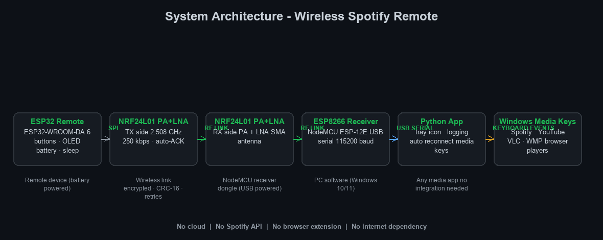
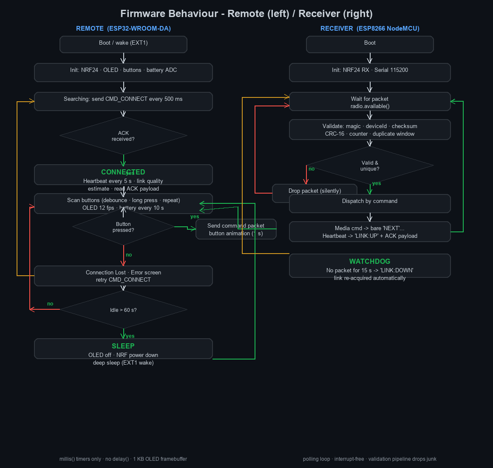
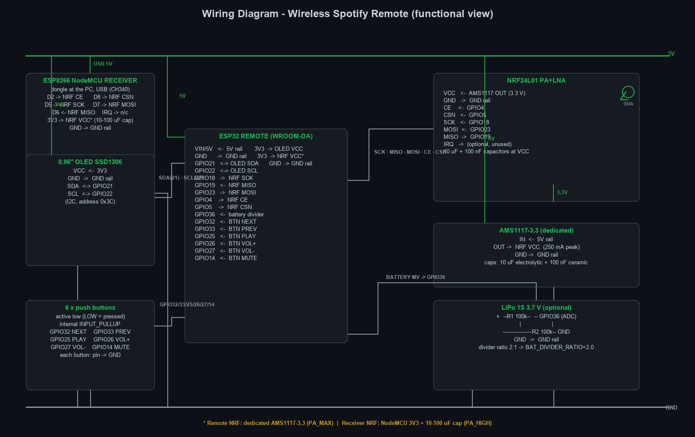

<p align="center">
  
</p>

<h1 align="center">USB-Powered Spotify Remote</h1>

<p align="center">
  <b>Physical media controls for Windows</b> — an ESP32 remote that talks to your
  PC over a 2.5&nbsp;GHz radio link and drives <i>Spotify, VLC, YouTube Music</i>
  and any other media app, with zero drivers and a live link-status display.
</p>

<p align="center">
  
  
  
  
  
  
</p>

---

## How it works

```
┌─────────────┐     2.508 GHz / 250 kbps     ┌─────────────┐     USB serial      ┌──────────────┐
│  ESP32      │  ◄────────────────────────►  │  ESP8266    │  ────────────────►  │  Windows     │
│  Remote     │   encrypted NRF24L01 PA+LNA  │  NodeMCU    │  `NEXT|PLAY|...`    │  Python app  │
│  (OLED + 6  │  auto-ACK · CRC-16 · retries │  Receiver   │                     │  media keys  │
│   buttons)  │                              │             │                     │              │
└─────────────┘                              └─────────────┘                     └──────────────┘
```

Every press of a button is packed into a **20-byte encrypted packet**, sent with
radio-level auto-retry, acknowledged by the receiver — and the ACK itself
becomes the remote's **live link-quality meter** (`Link: 96%` + 5 bars on the
OLED). The receiver validates and forwards the command over USB; the tray app
presses the matching Windows media key. No drivers, no pairing, no network.

---

## Features

**Remote (ESP32-WROOM-DA)**
- Six media keys — Next · Previous · Play/Pause · Vol ▲ · Vol ▼ · Mute
- Non-blocking debounce, **long-press About screen**, **hold-to-repeat** volume
- 128×64 SSD1306 OLED: boot splash → searching → home (link %, status, last
  command, idle timer, FW) → button icons → connection-lost → About
- **Link quality from TX/ACK success** — no fake RSSI, honest numbers
- Auto-reconnect (search every 500 ms) · heartbeat every 5 s · 15 s link timeout

**Link security & reliability**
- 20-byte packets: magic → device ID → **XOR-stream encryption** (16-byte key) → CRC-16/XMODEM → XOR checksum → monotonic counter (replay protection)
- Auto-ACK · CRC-16 · 15 transmit retries · duplicate rejection · unknown-device rejection

**Receiver (ESP8266 NodeMCU)**
- NRF24 RX with ACK payloads, watchdog, and a clean serial protocol
- Plug-and-play with the Python app — no drivers needed

**App (Windows, Python 3.9+)**
- System-tray controller: live link state, battery-less status, reconnect, notifications
- Converts to real **media keys** — works with Spotify, VLC, YouTube Music, Edge, and more

---

## Architecture

<p align="center">
  
  <br><sub>The remote's non-blocking state machine — everything runs on <code>millis()</code>, no <code>delay()</code> in the loop.</sub>
</p>

| Layer | Component | Role |
|---|---|---|
| **Remote** | `ESP32-WROOM-DA` | scans buttons, builds/encrypts packets, drives OLED |
| **Link** | `NRF24L01 PA+LNA` ×2 | 2.508 GHz, 250 kbps, auto-ACK, dynamic payloads |
| **Receiver** | `ESP8266 NodeMCU` | validates packets, ACK payloads, USB serial bridge |
| **Host** | `Python tray app` | serial → Windows media keys |

---

## Wiring

<p align="center">
  
</p>

All grounds are common. Every button is active-low between its GPIO and GND
(firmware uses `INPUT_PULLUP`).

| Device | ESP32 pin | Notes |
|---|---:|---|
| OLED SDA | GPIO21 | I2C data |
| OLED SCL | GPIO22 | I2C clock |
| OLED VCC | GPIO2 | display-power pin (firmware-controlled) |
| NRF24 CE | GPIO4 | |
| NRF24 CSN | GPIO5 | |
| NRF24 SCK | GPIO18 | VSPI clock |
| NRF24 MOSI | GPIO23 | VSPI MOSI |
| NRF24 MISO | GPIO19 | VSPI MISO |
| Next | GPIO32 | button → GND |
| Previous | GPIO33 | button → GND |
| Play/Pause | GPIO25 | button → GND · hold for **About** |
| Volume Up | GPIO26 | button → GND · hold to **repeat** |
| Volume Down | GPIO27 | button → GND · hold to **repeat** |
| Mute | GPIO14 | button → GND |

> **Warning — power the NRF24L01 PA+LNA from 3.3 V ONLY, never 5 V.** Put a
> 10–100 µF capacitor directly across its VCC/GND pins; PA+LNA modules draw
> sharp current spikes, so keep leads short and the supply stable.

---

## Getting started

### 1. Remote — Arduino Web Editor (ESP32)

Create a sketch named `remote` and upload **every file from `Remote/`** as tabs:

```
remote.ino  globals.h  config.h  protocol.h
nrf_comm.h  nrf_comm.cpp  buttons.h  buttons.cpp  ui.h  ui.cpp
```

1. Board: **ESP32 Dev Module** (core 2.0.17 — also builds on 3.x)
2. Libraries: **RF24 (TMRh20)**, **Adafruit SSD1306**, **Adafruit GFX**, **Adafruit BusIO**
3. Upload — the OLED walks you through boot → search → connect
4. Debugging: set `SERIAL_DEBUG` to `1` in `remote.ino` and watch 115200 baud
   for `[BOOT]`/`[TX]` markers plus any ESP32 panic reason

### 2. Receiver — Arduino Web Editor (ESP8266)

The whole receiver — sketch, modules **and** a patched RF24 — lives in
`Receiver/NodeMCU_sketch/`. Create a sketch named `nodeMCU` and upload **every
file from that folder** as tabs (no library import needed):

```
receiver.ino  nrf_rx.h  nrf_rx.cpp  config.h  protocol.h
RF24.h  RF24.cpp  RF24_config.h  nRF24L01.h  printf.h
```

1. Board: **NodeMCU 1.0 (ESP-12E Module)**, **ESP8266 core 2.5.0**
2. Upload — expect `READY` + `INFO:fw=...` on its serial port

> **Why vendored RF24?** ESP8266 core 2.5.0 ships a broken `pgm_read_ptr()`
> macro, so unpatched RF24 fails to compile. Importing the patched ZIP
> (`Receiver/RF24-1.4.6-ESP8266-2.5.0.zip`) works in principle, but the Web
> Editor can silently keep using a stale, unpatched RF24 copy. Vendoring the
> patched files inside the sketch makes the build deterministic. See
> `Receiver/RF24_ESP8266_2_5_0.md`.

### 3. Windows app

```bat
cd Python
python -m venv venv
venv\Scripts\activate
pip install -r requirements.txt
copy config.example.json config.json   :: then set encryption_key!
python main.py
```

The app auto-detects the receiver's serial port, reconnects, and sits in the
system tray. **Before first run**: `encryption_key` in `config.json` must match
the `ENCRYPTION_KEY` in both `config.h` files.

### One-time pairing (do this once)

`DEVICE_ID`, `ENCRYPTION_KEY`, `RF_CHANNEL` and `RECEIVER_ADDRESS` must match
across `Remote/config.h`, `Receiver/config.h` and `Python/config.json`:

| Parameter | Remote | Receiver |
|---|---|---|
| Channel | `RF_CHANNEL = 108` | same |
| Address | `RECEIVER_ADDRESS = "RX1RD"` | same |
| Device ID | `DEVICE_ID = 0xA1B2` | same |
| Key | `ENCRYPTION_KEY` (16 B) | same |

---

## Packet format

| Bytes | Field | Purpose |
|---|---|---|
| 0 | magic `0x5A` | cheap garbage rejection |
| 1–2 | `deviceId` `0xA1B2` | device pairing |
| 3–4 | `packetNumber` | duplicate detection |
| 5–8 | `timestampMs` | reboot detection |
| 9 | `command` | NEXT…MUTE / HEARTBEAT / CONNECT / ACK / STATUS |
| 10 | `flags` | encrypted · heartbeat |
| 11–12 | `crc16` | CRC-16/XMODEM (bytes 0–10 + 13–18) |
| 13–14 | `fwVersion` | firmware version |
| 15–18 | `counter` | monotonic counter (replay protection) |
| 19 | `checksum` | XOR of bytes 0–18 |

Bytes **5–18 are XOR-obfuscated** with a keystream derived from `packetNumber`
and the shared 16-byte key. The receiver validates in order: magic → device ID →
decrypt → checksum → CRC → monotonicity → duplicates → dispatch.

## Serial protocol (receiver → app)

| Line | Meaning |
|---|---|
| `READY` | boot acknowledgement |
| `INFO:fw=1.0.0,dev=A1B2` | identity |
| `LINK:UP` / `LINK:DOWN` | radio link state |
| `NEXT` · `PREVIOUS` · `PLAY` · `VOLUP` · `VOLDOWN` · `MUTE` | media command |
| `STATUS:legacy` | legacy `CMD_STATUS` from older remotes |
| `HEARTBEAT` · `PONG` · `WARN:...` | keep-alive, ping reply, diagnostics |

---

## Repository layout

```
SpotifyRemote/
├── Remote/                     ESP32 remote firmware (Web Editor ready)
│   ├── remote.ino              main loop · link state machine · serial debug
│   ├── globals.h               shared types + externs (build-order safe)
│   ├── nrf_comm.h/.cpp         NRF24 TX · packet build · encryption · link quality
│   ├── buttons.h/.cpp          debounce · long press · hold repeat
│   ├── ui.h/.cpp               OLED screens · icons · animations
│   └── config.h · protocol.h   pins/timing/identity · wire format
├── Receiver/                   ESP8266 receiver firmware
│   ├── NodeMCU_sketch/         ready-to-upload sketch + vendored patched RF24
│   │   ├── receiver.ino        main sketch
│   │   ├── nrf_rx.h/.cpp       radio RX · validation · ACK payloads
│   │   ├── config.h · protocol.h
│   │   └── RF24.h/.cpp/…       patched RF24 (core 2.5.0 compatible, vendored)
│   ├── RF24-1.4.6-ESP8266-2.5.0.zip   alternative: importable patched RF24
│   └── RF24_ESP8266_2_5_0.md   why the patch exists
├── Python/                     Windows tray media-key controller
│   ├── main.py · tray.py · serial_manager.py · media_controller.py …
│   └── config.example.json     template (real config.json is gitignored)
└── docs/                       diagrams + generator (generate_diagrams.py)
```

---

## Built for the Web Editor

The firmware was designed specifically for **Arduino Web Editor**, where `.ino`
tab order and auto-generated prototypes are out of your control:

- `remote.ino` is the **only** `.ino`; every other module is a `.cpp` + `.h` pair
- All shared globals are `extern` in `globals.h`, **defined exactly once**
- Function prototypes live in each module's own header — the build can never
  break from tab order, and compiles cleanly on ESP32 cores 2.0.17 **and** 3.x

---

<p align="center">
  <sub>Made with an ESP32, an NRF24L01, and an unreasonable love for physical buttons.</sub>
</p>
